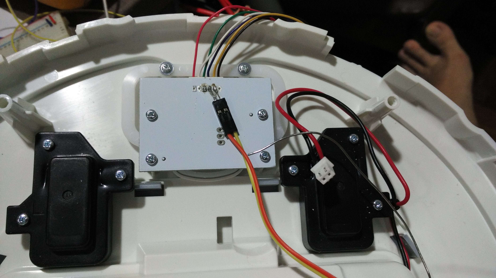
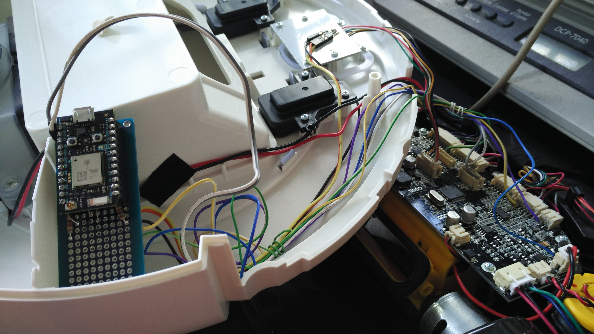
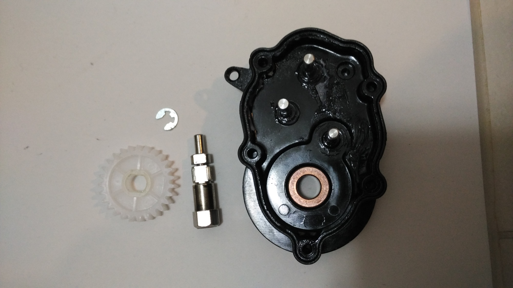

## Hacking a Ecovacs C250 vacuum cleaner


#### Robot brain specs

- Microcontroller: STM32F030RBT6
- Motor driver: Allegro A4950
- Omamp: LM224
- Battery protection: SII S-8254A

There are more Mosfets sitting around but i will not list them all out.

#### Background

This robotic vacuum cleaner was taken over from my uncle after it was deemed unsuitable for their use. The aim was to fix it and have it roam around my house, eating dirt along the way! :)

#### Resources

You can find more stuff in this repo:

- [Handwritten notes](Handwritten Notes)
- [Datasheet](Datasheet)
- [Firmware](Firmware)
- [Photos](Photos)

#### To do

- [ ] find out the IR protocol
- [ ] increase the battery capacity
- [ ] remotely control modes
- [ ] website

---

## Hacking log

#### First fix attempt (03 July 2016)

The initial described symptom was: "unable to charge" and my guess was that the battery had depleted. I took out the battery, stripped out the wrapper and revealed the innards of the battery.

It turns out that they are using 3 x Samsung 18650 batteries in series and there's a protection circuit attached. Safety protection, sweet! Whipped out my trusty old **Revolectrix 4s** battery charger and attempted to manually pump in some juice.

Everything seems ok and the robot was able to power up, vacuum, BUT still unable to charge when docked.

#### Second fix attempt (05 July 2016)

Thinking that something weird must be going on, I took a look at the manual and went `aha!` Why is the required charging adapter `19V, 0.6A` while the one in the box is `12V, 1A`?

There must have been some mix up of the adapter during movement of the robot and that explains... Grabbing a laptop power supply and plugging it in did the trick!

Woohooo! Free robotic vacuum cleaner! XD

#### First reverse engineering (23 July 2016)

With the robot proven to be functional, the next step was to [IoT-rize]() it. That's like a fancy word for, `EVERYTHING SHALL BE INTERNET CONNECTED`.

The first step was to figure out where all the signals were heading, how they are wired up and what's the best way to `tap em all`.

There are:
- 2 x bump switch
- 3 x edge sensors
- 4 x IR receiver
- 1 x control button
- 2 x status led (red, green)
- 1 x Docking port

**Switches**

All i did was to wire up a resistor (1k) between the switch logic to an GPIO set as digital input to capture the switch status.

**Edge sensors**

I was monitoring the signal coming from the edge sensors but failed to determine how they behave when an edge is detected. First looks tells me that they are bouncing Infrared light off the surface to determine if there's a cliff ahead.

There should be some way to capture the signal (and also manipulate the signal) so this is on the TO-DO list.

**IR receiver**

This is a classic 38KHz IR receiver with them located at the 10, 12, 2 and 6 O'clock direction. Managed to capture the IR signals using a logic analyzer but work has not been done to determine the exact protocol.

As of now, the only way to switch between modes (circular, homing, edge following etc) can only be done using a remote control. Having the IR protocol identified is critical for wireless control.

**status led**

Similar to the switches, the LEDs are wired up to GPIOs configured as analog inputs. The LEDs either stay on, off or breathes so being able to determine the analog voltage is essential.



**Docking port**

The docking port voltage is ~19V so a voltage divider was put in place. Quiescent current is 316uA and power consumption is 6mW. Mapping was determined through testing as `map(voltDock,0,2525,0,1260);`.

```
19V --/\/\/\-----/\/\/\-- GND
      50kohm  |  10kohm
			  |
       GPIO analog input
```

With all these information laid out, a schematic was drawn up and wired manually to a protoboard. The wifi-device used is a [Particle Photon](https://particle.io) and the ease of use allowed this project to be up and running in no more than one day!




You can see that `rob` was able to publish various information about itself to the world.

#### Third fix - slanted movement (31 July 2016)

Recently, Rob (yes his new name) started to drift left as vacuuming is carried out. Initial post-mortem is "heated motor" which is a tell tale sign for possible jamming.



With no proper fix unless the motor is replaced, i swapped the left and right motor to balance out the differences. Yes, we sometimes do that in robotics.
